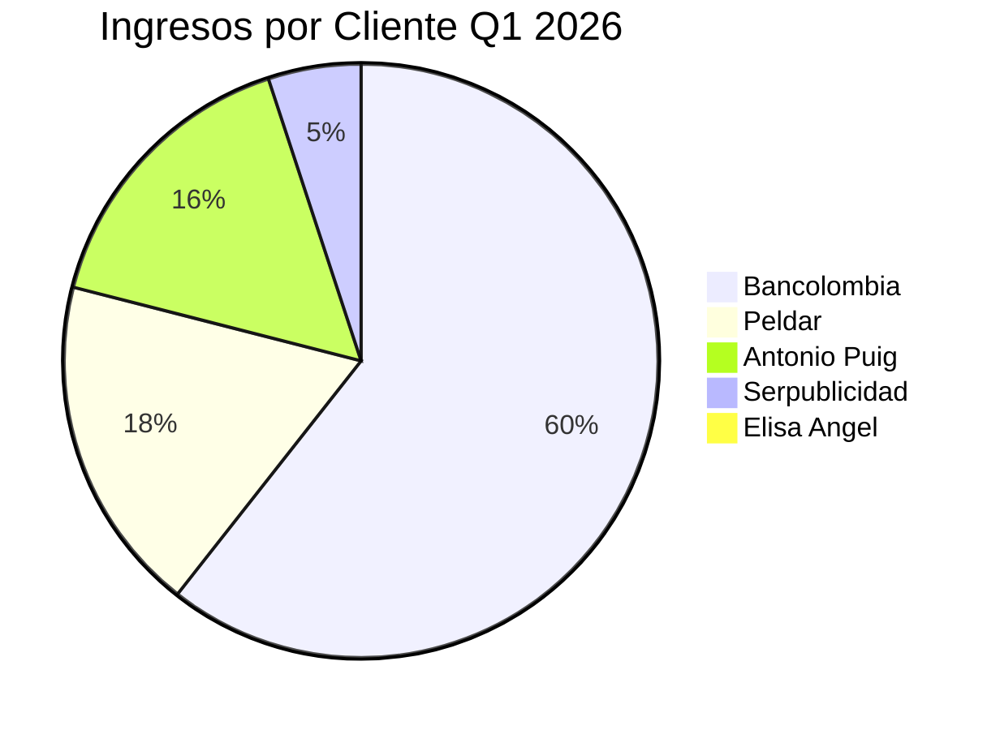

# 📊 INFORME FINANCIERO — Cuatrimestre Ene–Abr 2026
## La Magdalena S.A.S BIC · NIT 901578370
**Fecha del informe:** 11 de mayo de 2026 · **Reunión de Junta Directiva**

---

## 1. Resumen Ejecutivo

| KPI | Valor |
|---|---|
| **Ingresos totales** | **$115.513.840 COP** |
| **Costos totales** | **$90.814.507 COP** |
| **Flujo neto** | **+$24.699.333 COP** |
| **Margen operativo** | **21,4%** |
| Ingreso promedio mensual | $28.878.460 COP |
| Costo promedio mensual | $22.703.627 COP |
| Número de clientes activos | 5 |
| Número de proveedores únicos | 42 |
| Facturas de egresos procesadas | 96 (7 duplicados eliminados) |

> [!IMPORTANT]
> El cuatrimestre cierra con un margen positivo de **21,4%** y una tendencia de crecimiento extraordinaria: de un enero en rojo (-11,8%) a un abril con margen del **43%**. La empresa logró triplicar sus ingresos en 4 meses.

---

## 2. Estado de Resultados Mensual

| Concepto | Enero | Febrero | Marzo | Abril | **TOTAL** |
|---|---:|---:|---:|---:|---:|
| **Ingresos brutos** | $13.595.040 | $19.495.040 | $25.781.734 | $41.104.523 | **$99.976.337** |
| IVA cobrado | $2.583.058 | $3.704.058 | $4.898.529 | $4.351.858 | $15.537.503 |
| **Ingresos totales** | **$16.178.098** | **$23.199.098** | **$30.680.263** | **$45.456.381** | **$115.513.840** |
| **Costos totales** | $18.081.542 | $22.871.719 | $23.962.875 | $25.898.371 | **$90.814.507** |
| **Flujo neto** | **-$1.903.444** | **+$327.379** | **+$6.717.388** | **+$19.558.010** | **+$24.699.333** |
| **Margen** | **-11,8%** | **1,4%** | **21,9%** | **43,0%** | **21,4%** |

### Visualización de tendencia

```
Ingresos vs Costos (millones COP)
                                                          ███ 45,5M
                                     ███ 30,7M
                    ███ 23,2M                              ▓▓▓ 25,9M
███ 16,2M           ▓▓▓ 22,9M        ▓▓▓ 24,0M
▓▓▓ 18,1M

 ENERO              FEBRERO           MARZO              ABRIL

███ = Ingresos   ▓▓▓ = Costos
```

> [!TIP]
> **Hallazgo clave:** Los costos se mantuvieron relativamente estables ($18M–$26M), mientras los ingresos se dispararon de $16M a $45M. Esto indica escalabilidad operativa: la empresa crece en ingresos sin aumentar proporcionalmente los costos.

---

## 3. Análisis de Ingresos — Composición por Cliente

| Cliente | Ene | Feb | Mar | Abr | **Total** | **% del total** |
|---|---:|---:|---:|---:|---:|---:|
| Bancolombia S.A. | $16.178.098 | $16.178.098 | $17.828.263 | $19.164.373 | **$69.348.832** | **60,0%** |
| Cristalería Peldar S.A. | — | $7.021.000 | $7.021.000 | $7.021.000 | **$21.063.000** | **18,2%** |
| Antonio Puig S.A. | — | — | — | $18.200.008 | **$18.200.008** | **15,8%** |
| Serpublicidad Ltda. | — | — | $5.831.000 | — | **$5.831.000** | **5,0%** |
| Elisa Angel Estudio S.A.S | — | — | — | $1.071.000 | **$1.071.000** | **0,9%** |
| **TOTAL** | **$16.178.098** | **$23.199.098** | **$30.680.263** | **$45.456.381** | **$115.513.840** | **100%** |

### Diagnóstico de concentración de cartera



> [!WARNING]
> **Riesgo de concentración:** El 60% de los ingresos proviene de un solo cliente (Bancolombia). Si este contrato se pierde o reduce, la empresa entraría inmediatamente en territorio negativo. Se recomienda un plan activo de diversificación para reducir esta dependencia a menos del 40% en el próximo semestre.

### Evolución de la diversificación

| Mes | # Clientes | Cliente principal | % concentración |
|---|---|---|---|
| Enero | 1 | Bancolombia | **100%** ⚠️ |
| Febrero | 2 | Bancolombia | 69,7% |
| Marzo | 3 | Bancolombia | 58,1% |
| Abril | 4 | Bancolombia | 42,2% |

> [!TIP]
> **Tendencia positiva:** La diversificación mejoró significativamente. En enero Bancolombia representaba el 100%, para abril bajó al 42%. Los nuevos clientes (Puig, Peldar, Serpublicidad) son empresas grandes con potencial de crecimiento. Mantener esta trayectoria.

---

## 4. Análisis de Costos — Estructura por Categoría

| Categoría | Total Q1 | % del gasto | # Transacciones |
|---|---:|---:|---:|
| 🧑‍💼 **Talento humano / Freelancers** | **$76.148.137** | **83,9%** | 39 |
| 🔧 Suministros y operación | $4.729.753 | 5,2% | 18 |
| 🎨 Producción creativa y medios | $3.769.491 | 4,2% | 5 |
| 🚗 Transporte y combustible | $2.174.382 | 2,4% | 11 |
| 📦 Almacenamiento y logística | $2.048.799 | 2,3% | 4 |
| 🍽️ Alimentación y hospitalidad | $1.010.945 | 1,1% | 12 |
| 💻 Tecnología y suscripciones | $933.000 | 1,0% | 7 |
| **TOTAL** | **$90.814.507** | **100%** | 96 |

### Top 10 proveedores por gasto acumulado

| # | Proveedor | Total Q1 | Categoría |
|---|---|---:|---|
| 1 | Andrés Camilo Romero Hoyos | **$38.400.000** | Talento humano |
| 2 | Daniela Restrepo Molina | $9.700.000 | Talento humano |
| 3 | Carolina Romero Hoyos | $8.268.000 | Talento humano |
| 4 | Edison Andrés Vasco Ríos | $4.748.137 | Talento humano |
| 5 | Catalina Romero Hoyos | $4.000.000 | Talento humano |
| 6 | Mariano García | $3.920.000 | Talento humano |
| 7 | Juan Pedro Sierra González | $3.800.000 | Talento humano |
| 8 | La R Fresh Minds Cool Brands SAS | $3.000.000 | Producción creativa |
| 9 | Mega Storage Colombia SAS | $2.048.799 | Almacenamiento |
| 10 | María Camila Escobar | $1.776.000 | Talento humano |

> [!IMPORTANT]
> **El 84% de los costos son talento humano.** Esto confirma que La Magdalena opera como una agencia de servicios profesionales donde el producto es el talento. Los costos operativos (tecnología, almacenamiento, transporte) son apenas el 16%.

---

## 5. Análisis de Talento — El motor financiero

Dado que el talento representa el **84% de los costos**, merece un análisis detallado:

| Persona | Pago mensual estimado | Total Q1 | Observaciones |
|---|---:|---:|---|
| Andrés Camilo Romero H. | ~$9.600.000 | $38.400.000 | **Mayor costo.** Pagos constantes $5M + extras |
| Daniela Restrepo M. | ~$2.425.000 | $9.700.000 | Se incluyen notas débito (-$3.1M corregida) |
| Carolina Romero H. | ~$2.067.000 | $8.268.000 | Pagos entre $1.9M y $2.2M/mes |
| Edison Andrés Vasco R. | ~$1.187.000 | $4.748.137 | Solo en abril (2 pagos) |
| Catalina Romero H. | ~$1.000.000 | $4.000.000 | Pago estable $1M/mes |
| Mariano García | ~$980.000 | $3.920.000 | Pago estable ~$1M/mes |
| Juan Pedro Sierra G. | ~$950.000 | $3.800.000 | Pagos variables |
| María Camila Escobar | — | $1.776.000 | Solo en marzo |
| Nicolás Gutiérrez | — | $1.152.000 | Solo en enero |
| Verónica Cuartas S. | — | $0 | $3.1M + nota débito ($0 neto) |
| Diego A. Correa Santa | — | $384.000 | Solo en abril (corregido con nota débito) |

> [!NOTE]
> **Nómina implícita mensual:** ~$19M COP/mes en pagos a contratistas. Es importante evaluar si alguno de estos roles debería formalizarse con contrato laboral para optimización tributaria y estabilidad.

---

## 6. Costos Operativos — Desglose detallado

### 💻 Tecnología y suscripciones — $933.000 COP

| Servicio | Total Q1 | Frecuencia |
|---|---:|---|
| Google (Workspace + Ads) | $470.000 | Mensual |
| Adobe Creative Cloud | $280.000 | Mensual ($140K/mes) |
| PHmuseum | $92.000 | Puntual (febrero) |
| Shopify | $91.000 | Mensual |
| **Total** | **$933.000** | ~$233K/mes |

### 📦 Almacenamiento — $2.048.799 COP

| Proveedor | Total Q1 | Frecuencia |
|---|---:|---|
| Mega Storage Colombia | $2.048.799 | Mensual (~$512K/mes) |

### 🚗 Transporte y combustible — $2.174.382 COP

| Concepto | Total Q1 |
|---|---:|
| Vuelos (JetSmart) | $772.058 |
| Gasolina (Distracom, otros) | $1.062.324 |
| Otros transporte | $340.000 |

### 🍽️ Alimentación — $1.010.945 COP

Incluye: reuniones de negocios, alimentación de equipo, hospitalidad con clientes.

---

## 7. Indicadores Clave de Gestión

| Indicador | Valor | Interpretación |
|---|---:|---|
| **Ingreso por peso gastado** | $1,27 | Por cada $1 gastado se generan $1,27 en ingresos |
| **Punto de equilibrio mensual** | ~$22,7M | Facturación mínima para cubrir costos |
| **Costo por cliente atendido** | ~$22,7M | 4 clientes promedio = $5,7M por cliente |
| **Ingreso por cliente** | ~$28,9M | En promedio por mes |
| **Ratio talento/ingresos** | 66% | $0,66 de cada $1 de ingreso va a talento |
| **Meses con flujo positivo** | 3 de 4 | Feb, Mar, Abr (75% de los meses) |
| **Crecimiento ingreso M/M** | +43% promedio | Ene→Feb: +43%, Feb→Mar: +32%, Mar→Abr: +48% |

---

## 8. Alertas y Riesgos

### 🔴 Riesgos críticos

1. **Concentración en Bancolombia (60%):** Una reducción del 30% en este contrato eliminaría la totalidad del margen operativo. Plan de mitigación requerido.

2. **Dependencia de una sola persona clave:** Andrés Camilo Romero recibe $38,4M (42% del costo total). Si esta persona no está disponible, ¿cuál es el plan de contingencia?

3. **Informalidad laboral:** 9 personas reciben pagos recurrentes vía "Documento soporte" (contrato de prestación de servicios). Riesgo laboral si alguno reclama relación laboral.

### 🟡 Riesgos moderados

4. **Facturas duplicadas en el sistema:** Se detectaron 7 facturas registradas dos veces. Si no son correcciones intencionales, indica un problema de control interno.

5. **Estacionalidad desconocida:** El salto de abril ($45M) incluye $18,2M de Antonio Puig (un solo proyecto). Sin él, abril sería $27M, similar a marzo. No debe proyectarse como tendencia sostenible.

6. **IVA por pagar:** Se han cobrado $15,5M en IVA a clientes pero solo se han pagado ~$1,1M en IVA en costos. La diferencia (~$14,4M) debe provisionarse para pago a la DIAN.

### 🟢 Oportunidades

7. **Escalabilidad demostrada:** Los costos crecieron solo 43% ($18M→$26M) mientras los ingresos crecieron 181% ($16M→$45M). El modelo escala bien.

8. **Nuevos clientes de alto valor:** Antonio Puig ($18,2M) y Peldar ($21M) son multinacionales con presupuestos grandes. Hay potencial de crecimiento con cada uno.

---

## 9. Proyecciones — Mayo a Agosto 2026

### Supuestos

- **Bancolombia** mantiene promedio: ~$17,3M/mes
- **Peldar** mantiene contrato mensual: $7M/mes  
- **Antonio Puig** se proyecta solo 50% de recurrencia: $9,1M/mes (cada dos meses = $4,55M promedio)
- **Costos de talento** crecen 5% por nuevos proyectos
- **Costos operativos** se mantienen estables

| Escenario | Mayo | Junio | Julio | Agosto | **Total** |
|---|---:|---:|---:|---:|---:|
| **Optimista** | $38M | $42M | $38M | $42M | **$160M** |
| Ingresos optimista = Bancolombia + Peldar + Puig recurrente + 1 nuevo cliente ($5M) |||||
| **Base** | $29M | $29M | $29M | $29M | **$116M** |
| Ingresos base = Bancolombia + Peldar + Puig intermitente |||||
| **Pesimista** | $24M | $22M | $22M | $20M | **$88M** |
| Ingresos pesimista = Bancolombia reducido + Peldar, sin Puig |||||
| **Costos estimados** | $25M | $26M | $26M | $27M | **$104M** |

| Escenario | Flujo neto estimado | Margen |
|---|---:|---:|
| Optimista | +$56M | 35% |
| **Base** | **+$12M** | **10%** |
| Pesimista | -$16M | -18% |

> [!WARNING]
> En el escenario pesimista, la empresa entraría en déficit de -$16M en el cuatrimestre May–Ago. Es fundamental asegurar al menos uno de los dos nuevos clientes grandes (Puig o un equivalente) para mantenerse en positivo.

---

## 10. Recomendaciones Estratégicas

### 🎯 Corto plazo (Mayo–Junio 2026)

| # | Acción | Impacto esperado | Prioridad |
|---|---|---|---|
| 1 | **Renovar contrato Antonio Puig** — Negociar acuerdo semestral o anual | +$18M/trimestre asegurados | 🔴 Crítica |
| 2 | **Provisionar IVA** — Apartar $14,4M para pago DIAN bimestral | Evitar multas e intereses | 🔴 Crítica |
| 3 | **Limpiar duplicados del CSV** — Auditar las 7 facturas duplicadas | Control interno correcto | 🟡 Alta |
| 4 | **Crear fondo de reserva** — 2 meses de costos (~$45M) | Colchón ante estacionalidad | 🟡 Alta |

### 📈 Mediano plazo (Q3 2026)

| # | Acción | Impacto esperado | Prioridad |
|---|---|---|---|
| 5 | **Diversificar cartera** — Buscar 2–3 clientes nuevos tipo Peldar ($5M–$10M/mes) | Reducir dependencia Bancolombia a <40% | 🔴 Crítica |
| 6 | **Evaluar formalización laboral** — Analizar costo-beneficio de vincular contratistas clave | Reducir riesgo legal + estabilidad | 🟡 Alta |
| 7 | **Negociar tarifa Mega Storage** — $2M/cuatrimestre es significativo para almacenamiento | Potencial ahorro $200K–$400K/año | 🟢 Media |
| 8 | **Implementar presupuesto por proyecto** — Asignar costos por cliente/proyecto | Medir rentabilidad por cliente | 🟡 Alta |

### 🔭 Largo plazo (2026–2027)

| # | Acción | Impacto esperado |
|---|---|---|
| 9 | **Meta de ingresos anuales:** $350M–$400M COP | Si se mantiene la tendencia del cuatrimestre |
| 10 | **Estructura de costos óptima:** Talento <70%, Operación <15%, Tech <5%, Reserva >10% | Mayor resiliencia financiera |
| 11 | **Considerar contratación directa** para roles que superan $5M/mes | Mejor relación costo-beneficio + beneficios tributarios |

---

## 11. Conclusiones de la Junta

### ✅ Lo que va bien
1. **Crecimiento exponencial** de ingresos: de $16M a $45M en 4 meses (+181%)
2. **Costos controlados** con crecimiento moderado (+43%)
3. **Diversificación en marcha**: de 1 a 4 clientes activos
4. **Margen creciente**: de -11,8% a +43%
5. **Modelo de negocio escalable** demostrado en el cuatrimestre

### ⚠️ Lo que hay que corregir
1. La concentración en Bancolombia sigue siendo peligrosamente alta (60%)
2. No hay fondo de reserva ni provisión de IVA visible
3. El 84% de los costos en una categoría (talento) sin diversificación
4. Las facturas duplicadas sugieren debilidad en control contable
5. Los pagos vía documento soporte a 9+ personas representan riesgo laboral

### 🎯 KPIs para la próxima reunión (agosto 2026)
- [ ] Ingreso mensual promedio ≥ $30M
- [ ] Bancolombia ≤ 50% del ingreso total  
- [ ] Mínimo 5 clientes activos
- [ ] Fondo de reserva constituido ($45M)
- [ ] IVA provisionado y pagado
- [ ] Margen operativo ≥ 15%

---

> **Preparado para la Junta Directiva — 11 de mayo de 2026**  
> *Datos fuente: _consolidado.csv · 114 registros · Ene–Abr 2026*  
> *Análisis automatizado con deduplicación de facturas (7 duplicados excluidos)*
